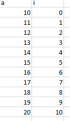
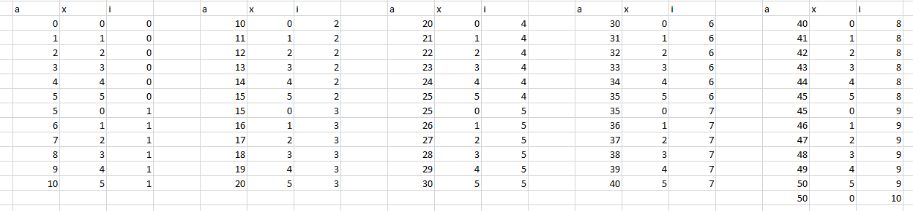
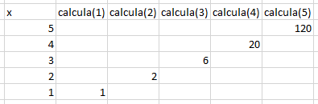

Respostas do teste

1) Alternativa a
2) Alternativa b
3) Alternativa b
    * Teste de mesa
  
    

4) Alternativa e
    * Teste de mesa


5) Alternativa c
    * Teste de mesa

   

6) Alternativa d

7) O CRUD é uma sigla para se referir às 4 operações básicas
de um banco de dados.
    - CREATE: Criar/inserir informações.
    - READ: Ler as informações armazenadas.
    - UPDATE: Atualizar as informações armazenadas.
    - DELETE: Remover as informações armazenadas.

8) O front-end corresponde à parte que o usuário pode interagir de uma aplicação(UI).
    * exemplo de linguagens: HTML, JavaScript, Angular e React

9) O back-end consiste na parte do sistema que está por trás da aplicação e que o usuário não tem acesso, nesta parte estão as regras de funcionamento da aplicação.
    * exemplo de linguagens: JAVA, C# e Python.

10) ```javascript
    function retornaApenasNumerosPares(list) {
        return list.filter(number => number % 2 === 0)
    }
    ```
11) Para as questões de 11 a 18, ver código anexo.
12) .
13) .
14) .
15) .
16) .
17) .
18) .
19) Git é uma ferramenta para armazenar, compartilhar e versionar o código de aplicações.
